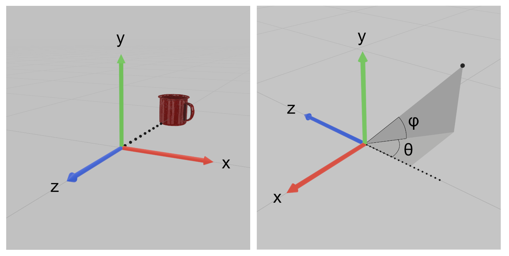

# Cartesian and Spherical Coordinates

Monty uses the _right-up-backward_ [axes convention](https://en.wikipedia.org/wiki/Axes_conventions), which is a [right-handed coordinate system](https://en.wikipedia.org/wiki/Right-hand_rule#Coordinates). Concretely, this means that
 - the x-axis points to the right,
 - the y-axis points up,
 - the z-axis points backwards.

Note that the forward direction therefore corresponds to the _negative_ z-axis. Users with a background in graphics programming (especially OpenGL) may be accustomed to this convention, but many find it unintuitive at first.

For spherical coordinates, we use the convention that places azimuth = 0 and elevation = 0 down the forward axis. More explicitly,
  - Azimuth (theta) is measured away from the forward axis, within the horizontal plane.
  - Elevation (phi) is measured up from the horizontal plane.

Be aware that this convention is not standard in [physics or mathematics](https://en.wikipedia.org/wiki/Spherical_coordinate_system), so it's also a common source of confusion and does not match most references you may find elsewhere.

When converting between Cartesian and spherical coordinates, both the Cartesian and spherical conventions must be accounted for. Should you need to implement these conversions yourself, the following convention-compliant formulae are provided as a reference:

where atan2 is the [2-argument arctangent](https://en.wikipedia.org/wiki/Atan2).

The above may be useful when, for example, writing motor policy code that steers a distant agent towards a target. [This video](https://www.youtube.com/watch?v=lu1FS3au7kg) has more details regarding this use case and other tips for handling actions and rotations.

## Example: Visualizing with matplotlib

Anytime we want to interface with external libraries, we need to account for any differences in axes conventions. For example, matplotlib uses the right-forward-up axes convention. Since Monty's data is in the right-up-backward convention, we must transform our data such that
 - x-coordinates become x-coordinates (no change),
 - y-coordinates become z-coordinates, and
 - z-coordinates become negative y-coordinates.

Otherwise, the data will be displayed with the incorrect orientation, as shown above (center).
