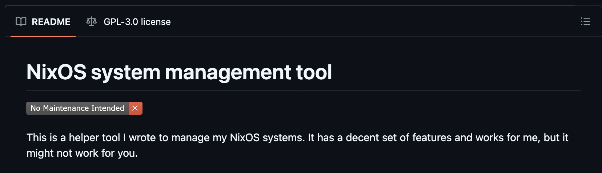

- Start Date: 2026-04-07
- RFC PR: (leave this empty, it will be filled in after RFC is merged)

The key words "MUST", "MUST NOT", "REQUIRED", "SHALL", "SHALL NOT", "SHOULD", "SHOULD NOT", "RECOMMENDED", "NOT RECOMMENDED", "MAY", and "OPTIONAL" in this document are to be interpreted as described in [BCP 14](https://tools.ietf.org/html/bcp14) [[RFC2119](https://tools.ietf.org/html/rfc2119)] [[RFC8174](https://tools.ietf.org/html/rfc8174)] when, and only when, they appear in all capitals, as shown here.

# Introduction

One of the aspects of the Thousand Brains Project (TBP)'s mission is to create an open-source platform for creating sensorimotor products. TBP already open-sourced multiple repositories. This RFC clarifies the level of maintenance and support that the [Maintainers](https://github.com/thousandbrainsproject/tbp.monty/blob/main/MAINTAINERS.md) intend to commit to any one repository.

# Repository Support Levels

The Maintainers categorize the intended level of maintenance and support to a repository into three categories: Unmaintained, Limited Maintenance, and Actively Maintained.

## Unmaintained

Maintainers have no intent to update the repository any further.

Unmaintained repositories SHALL be [archived as read-only](https://docs.github.com/en/repositories/archiving-a-github-repository/archiving-repositories).

## Limited Maintenance

Maintainers MAY provide some maintenance, time-permitting, at their own discretion.

Repositories with limited maintenance SHALL include a `Limited Maintenance` badge at the top of their README that, when clicked, links to the following text:

> [!IMPORTANT]
> This repository receives limited maintenance. It is maintained time-permitting at our own discretion. Issues and pull requests may not receive timely responses, and support or updates are not guaranteed. Community contributions are welcome but may be reviewed infrequently.

Markdown version to copy and paste:
```
> [!IMPORTANT]
> This repository receives limited maintenance. It is maintained time-permitting at our own discretion. Issues and pull requests may not receive timely responses, and support or updates are not guaranteed. Community contributions are welcome but may be reviewed infrequently.
```

As an example, here's a screenshot of a badge, albeit with a different text:



## Actively Maintained

Maintainers SHALL be actively engaged in supporting the repository.

Repositories that are actively maintained do not need to communicate their support level as the ongoing activity implies active maintenance.
