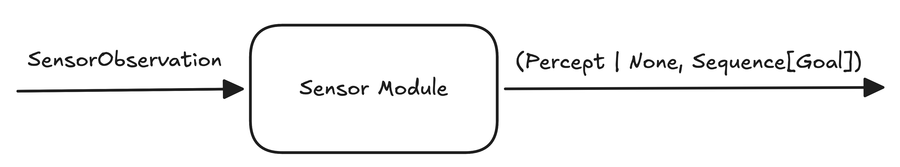

- Start Date: 2026-05-29
- RFC PR: (leave this empty, it will be filled in after RFC is merged)

# Sensor Modules as a Transformation Pipeline

Implementing a new Sensor Module should require only adding necessary and sufficient code corresponding to the new functionality. To that end, every Sensor Module can be implemented as a pipeline of reusable transforms.

# Motivation

## High-level API

Within a Thousand Brains System, the high-level Sensor Module API is to accept a `SensorObservation` from the environment and return an optional `Percept`, and a (possibly empty) sequence of `Goal`s.



## Transform Domains

Within the high-level API, there are four functional transform domains that loosely need to happen in the following sequence:

1. **Transforms** that operate on the raw environmental observation. For example: truncating depth information, adding noise, gaussian smoothing, translating depth modality into 3D coordinates, etc. Historically, these were a part of environment utilities.

2. **Feature Extractors** that turn environmental observation into a Cortical Messaging Protocol (CMP) Percept. For example: extracting features like principal curvatures, estimating pose vectors, converting RGB to HSV, determining if pose is fully defined, adding noise to the Percept features, etc.

3. **Filters** that determine whether the Percept should be sent to the Learning Module or not. For example, if the features changed sufficiently to warrant sending a message.

4. **Goal Generators** that create Sensor Module CMP Goals that will go directly to the Motor System.

The sequence is not exact, as Goal generators can be absent, or they can generate Goals based on raw observations, processed Percepts, or both. Similarly, filters can occur at any point in the process. The raw observations tend to be processed to create the Percept that will then be filtered, but this is not always the case.

## Sensor Module Creation

Historically, in order to create a new Sensor Module, the Contributor needed to implement a new, bespoke Python class that inherited from the abstract `SensorModule` class. All of the functionality of the Sensor Module would then be implemented within the `SensorModule.step()` method. It is very likely that the new Sensor Module would share functionality with already existing Sensor Modules. For example, the [CameraSM](https://github.com/thousandbrainsproject/tbp.monty/blob/e280beea563d579e4e5418a4abac0ab44bb84207/src/tbp/monty/frameworks/models/sensor_modules.py#L659), [TwoDSensorModue](https://github.com/thousandbrainsproject/tbp.monty/blob/e280beea563d579e4e5418a4abac0ab44bb84207/src/tbp/monty/frameworks/models/two_d_sensor_module.py#L193) shared the initial raw environmental observation Transform functionality via the [ObservationProcessor](https://github.com/thousandbrainsproject/tbp.monty/blob/a664f3935aae3abfef3d2061b573bed972c03992/src/tbp/monty/frameworks/models/sensor_modules.py#L115) component. They both had a configurable `MessageNoise` and `PerceptFilter` components. On the other hand, [SalienceSM](https://github.com/thousandbrainsproject/tbp.monty/blob/a664f3935aae3abfef3d2061b573bed972c03992/src/tbp/monty/frameworks/models/salience/sensor_module.py#L36) shared no common functionality with either of them, and [Probe](https://github.com/thousandbrainsproject/tbp.monty/blob/a664f3935aae3abfef3d2061b573bed972c03992/src/tbp/monty/frameworks/models/sensor_modules.py#L433) only logged the observation contents without any processing.

Writing bespoke sensor module implementations was toilsome, especially if functionality was being reused. Even with shared components like the [ObservationProcessor](https://github.com/thousandbrainsproject/tbp.monty/blob/a664f3935aae3abfef3d2061b573bed972c03992/src/tbp/monty/frameworks/models/sensor_modules.py#L115) there was still a lot of repetitive code.

## Reusable Components

Given the high-level API along with the general transform domains, it ought to be possible to design sensor modules as a data flow pipeline of reusable componetns, such that a new sensor module can be created entirely via configuration. Any functionality that does not exist, ought to be written in a generic way that can later be reused by a different sensor module. This way, new functionality is written once, and reused multiple times.

## Faster Research

The faster we can create different kinds of sensor modules with minimal mistakes, the faster the research feedback loop.

# Guide-level explanation

> Explain the proposal as if it was already included in Monty and you were teaching it to another Monty user. That generally means:
>
> - Introducing new named concepts.
> - Explaining the feature largely in terms of examples.
> - Explaining how Monty developers should *think* about the feature and how it should impact the way they use Monty. It should explain the impact as concretely as possible.
> - If applicable, provide sample error messages, deprecation warnings, or migration guidance.
> - If applicable, describe the differences between teaching this to existing Monty users and new Monty users.
> - If applicable, include pictures or other media if possible to visualize the idea.
> - If applicable, provide pseudo plots (even if hand-drawn) showing the intended impact on performance (e.g., the model converges quicker, accuracy is better, etc.).
> - Discuss how this impacts the ability to read, understand, and maintain Monty code. Code is read and modified far more often than written; will the proposed feature make code easier to maintain?
>
> Keep in mind that it may be appropriate to defer some details to the [Reference-level explanation](#reference-level-explanation) section.
>
> For implementation-oriented RFCs, this section should focus on how developer contributors should think about the change and give examples of its concrete impact. For administrative RFCs, this section should provide an example-driven introduction to the policy and explain its impact in concrete terms.

# Reference-level explanation

> This is the technical portion of the RFC. Explain the design in sufficient detail that:
>
> - Its interaction with other features is clear.
> - It is reasonably clear how the feature would be implemented.
> - Corner cases are dissected by example.
>
> The section should return to the examples from the previous section and explain more fully how the detailed proposal makes those examples work.

A Sensor Module is a data flow pipeline that begins with a `SensorObservation` and ends with an optional `Percept` and a (possibly empty) sequence of `Goal`s.


## Implementation Details

# TODO: Looks like Transforms need .reset() as part of their implementation, see FeatureChangeFilter for example

Internally, the Sensor Module data pipeline is assembled from a series of transforms that implement the `sensor_module.Transform` protocol:

```python
class Transform(Protocol):
    def __call__(
        self: Self,
        ctx: TransformContext,
        observation: SensorObservation,
        percept: Message | None,
        goals: Sequence[Goal],
    ) -> tuple[SensorObservation, Message | None, Sequence[Goal]]:
        ...
```

Where the `TransformContext` is:

```python
@dataclass
class TransformContext:
    rng: np.random.RandomState
    state: AgentState | None = None
    motor_only_step: bool = False
```

We define an `identity_transform` needed to "ground out" the transform pipeline:

```python
def identity_transform(
    ctx: TransformContext,  # noqa: ARG002
    observation: SensorObservation,
    percept: Message | None,
    goals: Sequence[Goal],
) -> tuple[SensorObservation, Message | None, Sequence[Goal]]:
    return observation, percept, goals
```

In order to fully assemble a Sensor Module, two additional boilerplate components are needed, the `TransformMiddleware` and the `TransformPipeline`:

```python
TransformMiddleware = Callable[[Transform], Transform]


class TransformPipeline(Transform):

    _transform: Transform

    def __init__(self: Self, transforms: Sequence[TransformMiddleware]) -> None:
        transform = identity_transform
        for next_transform in reversed(transforms):
            transform = next_transform(transform)
        self._transform = transform

    def __call__(
        self: Self,
        ctx: TransformContext,
        observation: SensorObservation,
        percept: Message | None,
        goals: Sequence[Goal],
    ) -> tuple[SensorObservation, Message | None, Sequence[Goal]]:
        return self._transform(ctx, observation, percept, goals)
```

With the above specifications and boilerplate in place, we can now author a generic `SensorModule`:

```python
class SensorModule:

    _agent_state: AgentState
    _goals: list[Goal]
    _sensor_id: SensorID
    _sensor_module_id: SensorModuleID
    _sensor_state: SensorState
    _transform_pipeline: TransformPipeline

    def __init__(
        self: Self,
        sensor_module_id: SensorModuleID,
        sensor_id: SensorID,
        transform_pipeline: TransformPipeline | None
    ) -> None:
        self._sensor_module_id = sensor_module_id
        self._sensor_id = sensor_id
        self._transform_pipeline = (
            transform_pipeline
            if transform_pipeline is not None
            else TransformPipeline([])
        )

    @property
    def sensor_module_id(self: Self) -> SensorModuleID:
        return self._sensor_module_id

    def propose_goals(self: Self) -> Sequence[Goal]:
        """Return the goals proposed by this Sensor Module."""
        return self._goals

    def step(
        self: Self,
        ctx: RuntimeContext,
        observation: SensorObservation,
        motor_only_step: bool = False
    ) -> Message | None:
        """Process an observation into a percept and goals.

        Args:
            ctx: The runtime context.
            observation: Sensor observation.
            motor_only_step: Whether the current step is a motor-only step.
        """
        transform_ctx = TransformContext(ctx.rng, self._agent_state, motor_only_step)
        _, percept, goals = self.transform_pipeline(transform_ctx, observation, None, [])
        self._goals = goals
        return percept

    def update_state(self: Self, agent: AgentState) -> None:
        """Update information about the sensor's location and rotation."""
        self._agent_state = agent
        sensor = agent.sensors[self._sensor_id]
        self._sensor_state = SensorState(
            position=agent.position
            + qt.rotate_vectors(agent.rotation, sensor.position),
            rotation=agent.rotation * sensor.rotation,
        )

```

## Configuration

With the generic `SensorModule` available, all of the business logic is now declared in
the configuration.

```yaml
sensor_modules:
  - _target_: tbp.monty.sensor_modules.SensorModule
    sensor_module_id: patch
    sensor_id: patch
    transform_pipeline:
      _target_: tbp.monty.sensor_modules.TransformPipeline
      transforms:
        - _target_: tbp.monty.sensor_modules.transforms.DepthTo3DLocations
          _partial_: true
          sensor_id: patch
          resolutions: [64, 64]
          world_coord: true
          zooms: 10.0
          get_all_points: true
          use_semantic_sensor: false
          is_depth_clip_sensors: true
        - _target_: tbp.monty.sensor_modules.transforms.MissingToMaxDepth
          _partial_: true
          max_depth: 1
        - _target_: tbp.monty.sensor_modules.transforms.GaussianSmoothing
          _partial_: true
          sigma: 6
          kernel_width: 8
        - _target_: tbp.monty.sensor_modules.transforms.AddNoiseToRawDepthImage
          _partial_: true
          sigma: 4
        - _target_: tbp.monty.sensor_modules.extractors.ObservationProcessor
          _partial_: true
          sensor_module_id: patch
          features:
            - rgba
            - hsv
            - pose_vectors
            - principal_curvatures
          pc1_is_pc2_threshold: 10
        - _target_: tbp.monty.sensor_modules.transforms.MessageNoise
          _partial_: true
          noise_params:
            features:
              pose_vectors: 2 # rotate by random degrees along xyz
              hsv: 0.1 # add gaussian noise with 0.1 std
              principal_curvatures_log: 0.1
              pose_fully_defined: 0.01 # flip bool in 1% of cases
            location: 0.002 # add gaussian noise with 0.002 std
        - _target_: tbp.monty.sensor_modules.filters.FeatureChangeFilter
          _partial_: true
          delta_thresholds:
            on_object: 0
            n_steps: 20
            hsv:
            - 0.1
            - 0.1
            - 0.1
            pose_vectors: ${np.list_eval:[np.pi / 4, np.pi * 2, np.pi * 2]}
            principal_curvatures_log:
            - 2
            - 2
            distance: 0.01

```

## Creating a Transform

New functionality is introduced by creating a new `Transform`.

The general pattern is to accept `next_transform: Transform` in the constructor and to finish the `__call__` implementation by invoking the `next_transform`.

```python
class MyTransform(Transform):

    _next_transform: Transform

    def __init__(
        self: Self,
        next_transform: Transform,
        # ...
    ) -> None:
        self._next_transform = next_transform
        # ...

    def __call__(
        self: Self,
        ctx: TransformContext,
        observation: SensorObservation,
        percept: Message | None,
        goals: Sequence[Goal],
    ) -> (SensorObservation, Message | None, Sequence[Goal]):
        # ...
        return self._next_transform(ctx, observation, percept, goals)
```

Note that it is possible to "early exit" out of the chain of transforms by not calling `self._next_transform`. For example:

```python
    def __call__(
        self: Self,
        ctx: TransformContext,
        observation: SensorObservation,
        percept: Message | None,
        goals: Sequence[Goal],
    ) -> (SensorObservation, Message | None, Sequence[Goal]):
        # ...
        return ctx, observation, percept, goals
```

While it is possible, as of this writing there are no specific use cases for this feature.

### Transforms

Raw environmental observation transforms focus on updating the `SensorObservation`. For example, if we were to write a `MissingToMaxDepth` transform:

```python
class MissingToMaxDepth(Transform):

    _next_transform: Transform
    _max_depth: float
    _threshold: float

    def __init__(
        self: Self,
        next_transform: Transform,
        max_depth: float,
        threshold: float = 0.0
    ) -> None:
        self._next_transform = next_transform
        self._max_depth = max_depth
        self._threshold = threshold

    def __call__(
        self: Self,
        ctx: TransformContext,
        observation: SensorObservation,
        percept: Message | None,
        goals: Sequence[Goal],
    ) -> (SensorObservation, Message | None, Sequence[Goal]):
        m = np.where(observation["depth"] <= self._threshold)
        observation["depth"][m] = self._max_depth
        return self._next_transform(ctx, observation, percept, goals)
```

### Feature Extractors

The main feature extractor is the `ObservationProcessor`. Rewriting the current version of it as a `Transform` would result in the example below. Note that the main change is the addition of `_next_transform` instance attribute and ending the `__call__` implementation with `return self._next_transform(ctx, observation, percept, goals)

```python
class PerceptIsNotNone(RuntimeError):
    """Raised when percept should be None but isn't."""

class ObservationProcessor(Transform):
    """Processes SensorObservations into Cortical Messages."""

    CURVATURE_FEATURES: ClassVar[list[str]] = [
        "principal_curvatures",
        "principal_curvatures_log",
        "gaussian_curvature",
        "mean_curvature",
        "gaussian_curvature_sc",
        "mean_curvature_sc",
        "curvature_for_TM",
    ]

    POSSIBLE_FEATURES: ClassVar[list[str]] = [
        "on_object",
        "object_coverage",
        "min_depth",
        "mean_depth",
        "rgba",
        "hsv",
        "pose_vectors",
        "principal_curvatures",
        "principal_curvatures_log",
        "pose_fully_defined",
        "gaussian_curvature",
        "mean_curvature",
        "gaussian_curvature_sc",
        "mean_curvature_sc",
        "curvature_for_TM",
        "coords_for_TM",
        "edge_strength",
        "coherence",
    ]

    _next_transform: Transform
    _features: list[str]
    _is_surface_sm: bool
    _pc1_is_pc2_threshold: int
    _sensor_module_id: str
    _surface_normal_method: SurfaceNormalMethod
    _weight_curvature: bool

    def __init__(
        self,
        next_transform: Transform,
        features: list[str],
        sensor_module_id: str,
        pc1_is_pc2_threshold=10,
        surface_normal_method=SurfaceNormalMethod.TLS,
        weight_curvature=True,
        is_surface_sm=False,
    ) -> None:
        """Initializes the ObservationProcessor.

        Args:
            next_transform: The next transform to invoke in the transform pipeline.
            features: List of features to extract.
            pc1_is_pc2_threshold: Maximum difference between pc1 and pc2 to be
                classified as being roughly the same (ignore curvature directions).
                Defaults to 10.
            sensor_module_id: ID of sensor module.
            surface_normal_method: Method to use for surface normal extraction. Defaults
              to TLS.
            weight_curvature: Whether to use the weighted implementation for principal
                curvature extraction (True) or unweighted (False). Defaults to True.
            is_surface_sm: Surface SMs do not require that the central pixel is
                "on object" in order to process the observation (i.e., extract
                features). Defaults to False.
        """
        for feature in features:
            assert feature in self.POSSIBLE_FEATURES, (
                f"{feature} not part of {self.POSSIBLE_FEATURES}"
            )
        self._next_transform = next_transform
        self._features = features
        self._is_surface_sm = is_surface_sm
        self._pc1_is_pc2_threshold = pc1_is_pc2_threshold
        self._sensor_module_id = sensor_module_id
        self._surface_normal_method = surface_normal_method
        self._weight_curvature = weight_curvature

    def __call__(
        self: Self,
        ctx: TransformContext,
        observation: SensorObservation,
        percept: Message | None,
        goals: Sequence[Goal],
    ) -> (SensorObservation, Message | None, Sequence[Goal]):
        if percept is not None:
            raise PerceptIsNotNone

        obs_3d = observation["semantic_3d"]
        sensor_frame_data = observation["sensor_frame_data"]
        cam_to_world = observation["cam_to_world"]
        rgba_feat = observation["rgba"]
        depth_feat = (
            observation["depth"]
            .reshape(observation["depth"].size, 1)
            .astype(np.float64)
        )
        # Assuming squared patches
        center_row_col = rgba_feat.shape[0] // 2
        # Calculate center ID for flat semantic obs
        obs_dim = int(np.sqrt(obs_3d.shape[0]))
        half_obs_dim = obs_dim // 2
        center_id = half_obs_dim + obs_dim * half_obs_dim
        # Extract all specified features
        features = {}
        if "object_coverage" in self._features:
            # Last dimension is semantic ID (integer >0 if on any object)
            features["object_coverage"] = sum(obs_3d[:, 3] > 0) / len(obs_3d[:, 3])
            assert features["object_coverage"] <= 1.0, (
                "Coverage cannot be greater than 100%"
            )

        x, y, z, semantic_id = obs_3d[center_id]
        on_object = semantic_id > 0
        if on_object or (self._is_surface_sm and features["object_coverage"] > 0):
            (
                features,
                morphological_features,
                valid_signals,
            ) = self._extract_and_add_features(
                features,
                obs_3d,
                rgba_feat,
                depth_feat,
                center_id,
                center_row_col,
                sensor_frame_data,
                cam_to_world,
            )
        else:
            valid_signals = False
            morphological_features = {}

        if "on_object" in self._features:
            morphological_features["on_object"] = float(on_object)

        # Sensor module returns features at a location in the form of a Message class.
        # use_state is a bool indicating whether the input is "interesting",
        # which indicates that it merits processing by the learning module; by default
        # it will always be True so long as the surface normal and principal curvature
        # directions were valid; certain SMs and policies used separately can also set
        # it to False under appropriate conditions

        percept = Message(
            location=np.array([x, y, z]),
            morphological_features=morphological_features,
            non_morphological_features=features,
            confidence=1.0,
            use_state=on_object and valid_signals,
            sender_id=self._sensor_module_id,
            sender_type="SM",
        )
        # This is just for logging! Do not use _ attributes for matching
        percept._semantic_id = semantic_id

        return self._next_transform(ctx, observation, percept, goals)

    def _extract_and_add_features(
        self,
        features: dict[str, Any],
        obs_3d: np.ndarray,
        rgba_feat: np.ndarray,
        depth_feat: np.ndarray,
        center_id: int,
        center_row_col: int,
        sensor_frame_data: np.ndarray,
        cam_to_world: np.ndarray,
    ) -> tuple[dict[str, Any], dict[str, Any], bool]:
        """Extract features configured for extraction from sensor patch.

        Returns the features in the patch, and True if the surface normal
        and principal curvature directions are well-defined.

        Returns:
            features: The features in the patch.
            morphological_features: ?
            valid_signals: True if the surface normal and principal curvature
                directions are well-defined.
        """
        # ------------ Extract Morphological Features ------------
        # Get surface normal for graph matching with features
        surface_normal, valid_sn = self._get_surface_normals(
            obs_3d, sensor_frame_data, center_id, cam_to_world
        )

        k1, k2, dir1, dir2, valid_pc = principal_curvatures(
            obs_3d, center_id, surface_normal, weighted=self._weight_curvature
        )
        # TODO: test using log curvatures instead
        if np.abs(k1 - k2) < self._pc1_is_pc2_threshold:
            pose_fully_defined = False
        else:
            pose_fully_defined = True

        morphological_features: dict[str, Any] = {
            "pose_vectors": np.vstack(
                [
                    surface_normal,
                    dir1,
                    dir2,
                ]
            ),
            "pose_fully_defined": pose_fully_defined,
        }
        # ---------- Extract Optional, Non-Morphological Features ----------
        if "rgba" in self._features:
            features["rgba"] = rgba_feat[center_row_col, center_row_col]
        if "min_depth" in self._features:
            features["min_depth"] = np.min(depth_feat[obs_3d[:, 3] != 0])
        if "mean_depth" in self._features:
            features["mean_depth"] = np.mean(depth_feat[obs_3d[:, 3] != 0])
        if "hsv" in self._features:
            rgba = rgba_feat[center_row_col, center_row_col]
            hsv = rgb2hsv(rgba[:3])
            features["hsv"] = hsv

        # Note we only determine curvature if we could determine a valid surface normal
        if any(feat in self.CURVATURE_FEATURES for feat in self._features) and valid_sn:
            if valid_pc:
                # Only process the below features if the principal curvature was valid,
                # and therefore we have a defined k1, k2 etc.
                if "principal_curvatures" in self._features:
                    features["principal_curvatures"] = np.array([k1, k2])

                if "principal_curvatures_log" in self._features:
                    features["principal_curvatures_log"] = log_sign(np.array([k1, k2]))

                if "gaussian_curvature" in self._features:
                    features["gaussian_curvature"] = k1 * k2

                if "mean_curvature" in self._features:
                    features["mean_curvature"] = (k1 + k2) / 2

                if "gaussian_curvature_sc" in self._features:
                    gc = k1 * k2
                    gc_scaled_clipped = scale_clip(gc, 4096)
                    features["gaussian_curvature_sc"] = gc_scaled_clipped

                if "mean_curvature_sc" in self._features:
                    mc = (k1 + k2) / 2
                    mc_scaled_clipped = scale_clip(mc, 256)
                    features["mean_curvature_sc"] = mc_scaled_clipped
        else:
            # Flag that PC directions are non-meaningful for e.g. downstream motor
            # policies
            features["pose_fully_defined"] = False

        valid_signals = valid_sn and valid_pc
        if not valid_signals:
            logger.debug("Either the surface-normal or pc-directions were ill-defined")

        return features, morphological_features, valid_signals

    def _get_surface_normals(
        self,
        obs_3d: np.ndarray,
        sensor_frame_data: np.ndarray,
        center_id: int,
        cam_to_world: np.ndarray,
    ) -> tuple[np.ndarray, bool]:
        if self._surface_normal_method == SurfaceNormalMethod.TLS:
            surface_normal, valid_sn = surface_normal_total_least_squares(
                obs_3d, center_id, cam_to_world[:3, 2]
            )
        elif self._surface_normal_method == SurfaceNormalMethod.OLS:
            surface_normal, valid_sn = surface_normal_ordinary_least_squares(
                sensor_frame_data, cam_to_world, center_id
            )
        elif self._surface_normal_method == SurfaceNormalMethod.NAIVE:
            surface_normal, valid_sn = surface_normal_naive(
                obs_3d, patch_radius_frac=2.5
            )
        else:
            raise ValueError(
                f"surface_normal_method must be in [{SurfaceNormalMethod.TLS} (default)"
                f", {SurfaceNormalMethod.OLS}, {SurfaceNormalMethod.NAIVE}]."
            )

        return surface_normal, valid_sn
```

### Filters

Filter transforms' main purpose is to filter. As an example, implementation of the `FeatureChangeFilter` as a `Transform` would look as follows:

```python
class FeatureChangeFilter(Transform):

    _delta_thresholds: dict[str, Any]
    _last_percent: Message
    _last_sent_n_steps_ago: int

    def __init__(
        self: Self,
        next_tranform: Transform,
        delta_thresholds: dict[str, Any]
    ) -> None:
        self._next_transform = next_transform
        self._delta_thresholds = delta_thresholds
        self._last_percept = None
        self._last_sent_n_steps_ago = 0

    def reset(self):
        """Reset buffer and is_exploring flag."""
        self._last_percept = None

    def _check_feature_change(self, percept: Message) -> bool:
        """Check feature change between last transmitted observation.

        Args:
            percept: Percept to check for feature change.

        Returns:
            True if the features have changed significantly.
        """
        if not percept.get_on_object():
            # Even for the surface-agent sensor, do not return a feature for LM
            # processing that is not on the object
            logger.debug("No new point because not on object")
            return False

        for feature in self._delta_thresholds:
            if feature not in ["n_steps", "distance"]:
                last_feat = self._last_percept.get_feature_by_name(feature)
                current_feat = percept.get_feature_by_name(feature)

            if feature == "n_steps":
                if self._last_sent_n_steps_ago >= self._delta_thresholds[feature]:
                    logger.debug(f"new point because of {feature}")
                    return True
            elif feature == "distance":
                distance = np.linalg.norm(
                    np.array(self._last_percept.location) - np.array(percept.location)
                )

                if distance > self._delta_thresholds[feature]:
                    logger.debug(f"new point because of {feature}")
                    return True

            elif feature == "hsv":
                last_hue = last_feat[0]
                current_hue = current_feat[0]
                hue_d = min(
                    abs(current_hue - last_hue), 1 - abs(current_hue - last_hue)
                )
                if hue_d > self._delta_thresholds[feature][0]:
                    return True
                delta_change_sv = np.abs(last_feat[1:] - current_feat[1:])
                for i, dc in enumerate(delta_change_sv):
                    if dc > self._delta_thresholds[feature][i + 1]:
                        logger.debug(f"new point because of {feature} - {i + 1}")
                        return True

            elif feature == "pose_vectors":
                angle_between = get_angle(
                    last_feat[0],
                    current_feat[0],
                )
                if angle_between >= self._delta_thresholds[feature][0]:
                    logger.debug(
                        f"new point because of {feature} angle : {angle_between}"
                    )
                    return True

            else:
                delta_change = np.abs(last_feat - current_feat)
                if len(delta_change.shape) > 0:
                    for i, dc in enumerate(delta_change):
                        if dc > self._delta_thresholds[feature][i]:
                            logger.debug(f"new point because of {feature} - {dc}")
                            return True
                elif delta_change > self._delta_thresholds[feature]:
                    logger.debug(f"new point because of {feature}")
                    return True
        return False

    def __call__(
        self: Self,
        ctx: TransformContext,
        observation: SensorObservation,
        percept: Message | None,
        goals: Sequence[Goal],
    ) -> (SensorObservation, Message | None, Sequence[Goal]):
        percept = self._filter(percept)
        return self._next_transform(ctx, observation, percept, goals)

    def _filter(self, percept: Message) -> Message:
        """Sets `percept.use_state` to False if features haven't changed significantly.

        Args:
            percept: Percept to check for feature change.

        Returns:
            Percept with `percept.use_state` set to False if features haven't
            changed significantly.
        """
        if not percept.use_state:
            # If we already know the features are uninteresting (e.g. invalid surface
            # normal due to <3/4 of the object in view, or motor only-step), then
            # don't bother with the below
            return percept

        if not self._last_percept:  # first step
            self._last_percept = percept  # type: ignore[assignment]
            self._last_sent_n_steps_ago = 0
            return percept

        significant_feature_change = self._check_feature_change(percept)

        # Save bool which will tell us whether to pass the information to LMs
        percept.use_state = significant_feature_change

        if significant_feature_change:
            # As per original implementation : only update the "last feature" when a
            # significant change has taken place
            self._last_percept = percept
            self._last_sent_n_steps_ago = 0
        else:
            self._last_sent_n_steps_ago += 1

        return percept
```

### Goal Generators

Some Sensor Module transforms may generate goals. For example, implementing the `SalienceSM` goal generation as a `Transform` would look something like:

```python
class Salience(Transform):

    _next_transform: Transform
    _sensor_module_id: str
    _salience_strategy: SalienceStrategy
    _return_inhibitor: ReturnInhibitor

    def __init__(
        self: Self,
        next_transform: Transform,
        sensor_module_id: str,
        salience_strategy: SalienceStrategy | None = None,
        return_inhibitor: ReturnInhibitor | None = None,
    ) -> None:
        self._next_transform = next_transform
        self._sensor_module_id = sensor_module_id
        self._salience_strategy = (
            Uniform() if salience_strategy is None else salience_strategy
        )
        self._return_inhibitor = (
            ReturnInhibitor() if return_inhibitor is None else return_inhibitor
        )

    def __call__(
        self: Self,
        ctx: TransformContext,
        observation: SensorObservation,
        percept: Message | None,
        goals: Sequence[Goal],
    ) -> (SensorObservation, Message | None, Sequence[Goal]):
        salience_map = self._salience_strategy(
            ctx=ctx, rgba=observation["rgba"], depth=observation["depth"]
        )

        on_object = on_object_observation(observation, salience_map)
        ior_weights = self._return_inhibitor(
            on_object.center_location, on_object.locations
        )
        salience = self._weight_salience(ctx, on_object.salience, ior_weights)

        goals.append(
            Goal(
                location=on_object.locations[i],
                morphological_features=None,
                non_morphological_features=None,
                confidence=salience[i],
                use_state=True,
                sender_id=self._sensor_module_id,
                sender_type="SM",
                goal_tolerances=None,
            )
            for i in range(len(on_object.locations))
        )

        return self._next_transform(ctx, observation, percept, goals)

    def _weight_salience(
        self,
        ctx: RuntimeContext,
        salience: np.ndarray,
        ior_weights: np.ndarray,
    ) -> np.ndarray:
        weighted_salience = self._decay_salience(salience, ior_weights)

        weighted_salience = self._randomize_salience(ctx, weighted_salience)

        return self._normalize_salience(weighted_salience)

    def _decay_salience(
        self, salience: np.ndarray, ior_weights: np.ndarray
    ) -> np.ndarray:
        decay_factor = 0.75
        return salience - decay_factor * ior_weights

    def _randomize_salience(
        self, ctx: RuntimeContext, weighted_salience: np.ndarray
    ) -> np.ndarray:
        randomness_factor = 0.05
        weighted_salience += ctx.rng.normal(
            loc=0, scale=randomness_factor, size=weighted_salience.shape[0]
        )
        return weighted_salience

    def _normalize_salience(self, weighted_salience: np.ndarray) -> np.ndarray:
        if weighted_salience.size == 0:
            return weighted_salience

        min_ = weighted_salience.min()
        max_ = weighted_salience.max()
        scale = max_ - min_
        if np.isclose(scale, 0):
            return np.clip(weighted_salience, 0, 1)

        return (weighted_salience - min_) / scale

    def reset(self) -> None:
        self._return_inhibitor.reset()
        self._snapshot_telemetry.reset()
```

# Drawbacks

> Why should we *not* do this? Please consider:
>
> - Implementation cost, both in terms of code size and complexity
> - Whether the proposed feature can be implemented outside of Monty
> - The impact on teaching people Monty
> - Integration of this feature with other existing and planned features
> - The cost of migrating existing Monty users (is it a breaking change?)
>
> There are tradeoffs to choosing any path. Please attempt to identify them here.

# Rationale and alternatives

> - Why is this design the best in the space of possible designs?
> - What other designs have been considered, and what is the rationale for not choosing them?
> - What is the impact of not doing this?

# Prior art and references

> Discuss prior art, both the good and the bad, in relation to this proposal.
> A few examples of what this can include are:
>
> - References
> - Does this functionality exist in other frameworks, and what experience has their community had?
> - Papers: Are there any published papers or great posts that discuss this? If you have some relevant papers to refer to, this can serve as a more detailed theoretical background.
> - Is this done by some other community and what were their experiences with it?
> - What lessons can we learn from what other communities have done here?
>
> This section is intended to encourage you as an author to think about the lessons from other frameworks and provide readers of your RFC with a fuller picture.
> If there is no prior art, that is fine. Your ideas are interesting to us, whether they are brand new or adaptations from other places.
>
> Note that while precedent set by other frameworks is some motivation, it does not on its own motivate an RFC.
> Please consider that Monty sometimes intentionally diverges from common approaches.

# Unresolved questions

> Optional, but suggested for first drafts.
>
> What parts of the design are still TBD?

# Future possibilities

> Optional.
>
> Think about what the natural extension and evolution of your proposal would
> be and how it would affect Monty and the Thousand Brains Project as a whole in a holistic way.
> Try to use this section as a tool to more fully consider all possible
> interactions with the Thousand Brains Project and Monty in your proposal.
> Also consider how this all fits into the future of Monty.
>
> This is also a good place to "dump ideas" if they are out of the scope of the
> RFC you are writing but otherwise related.
>
> If you have tried and cannot think of any future possibilities,
> you may simply state that you cannot think of anything.
>
> Note that having something written down in the future-possibilities section
> is not a reason to accept the current or a future RFC; such notes should be
> in the section on motivation or rationale in this or subsequent RFCs.
> The section merely provides additional information.
